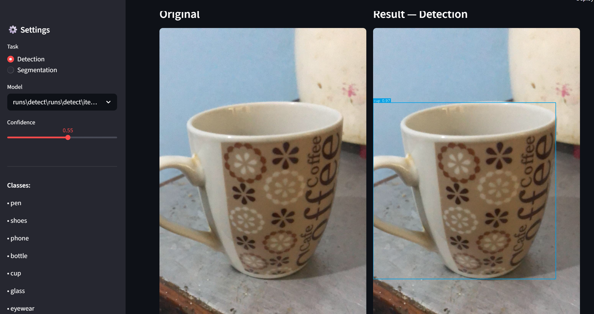
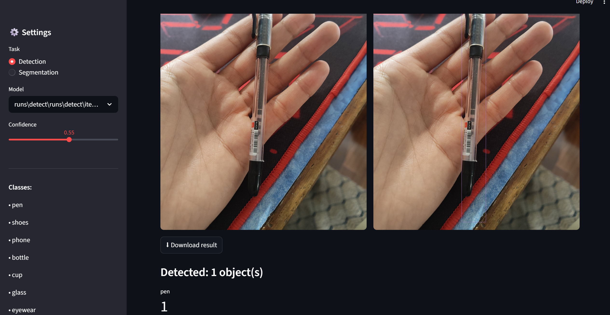
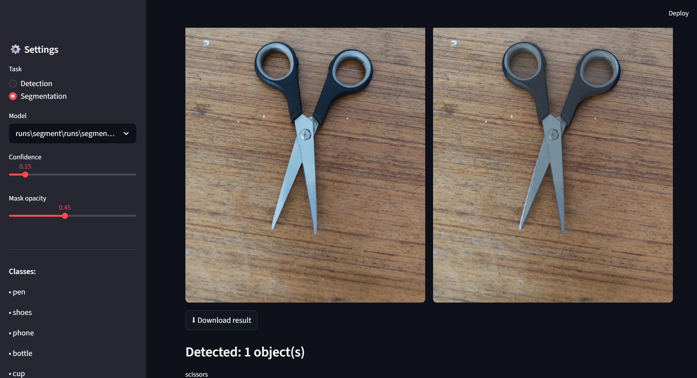
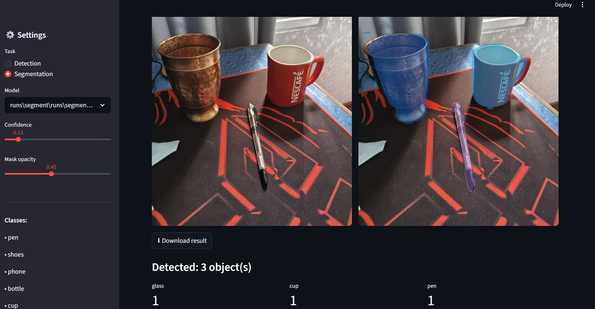
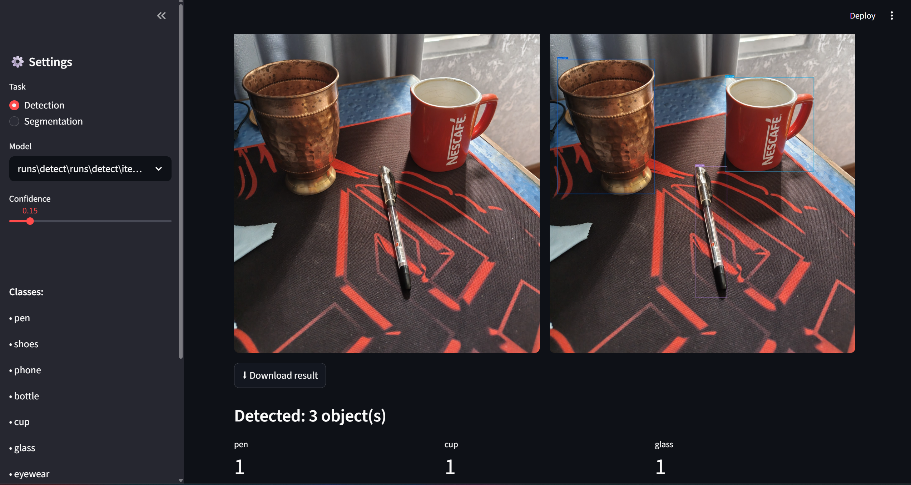

# 🎯 YOLO Daily Items — Object Detection & Segmentation

A custom **YOLOv8** computer vision project that detects and segments 11 everyday household objects using a self-collected dataset of 778 images annotated with polygon masks.

Built from scratch — including data collection, annotation, training, evaluation, and a live Streamlit demo app.

---

## 📸 Demo

### Detection




### Segmentation


### Streamlit App


---

## 📊 Results

| Model | Architecture | mAP50 | mAP50-95 |
|---|---|---|---|
| Detection | YOLOv8s | **0.869** | 0.790 |
| Segmentation | YOLOv8s-seg | **0.873** | 0.800 |

### Per-Class Detection mAP50

| Class | mAP50 |
|---|---|
| pen | 0.995 |
| scissors | 0.986 |
| wallet | 0.956 |
| watch | 0.982 |
| cup | 0.948 |
| bottle | 0.945 |
| phone | 0.911 |
| shoes | 0.813 |
| glass | 0.835 |
| eyewear | 0.695 |
| keys | 0.488 |

---

## 🗂 Dataset

- **Total images:** 778
- **Classes:** 11
- **Collection:** Self-collected using Redmi Note 10 Pro
- **Annotation:** Polygon masks via Roboflow Smart Polygon tool
- **Split:** 70% train / 20% val / 10% test

| Class | Images |
|---|---|
| pen | 74 |
| shoes | 82 |
| phone | 73 |
| bottle | 65 |
| cup | 93 |
| glass | 59 |
| eyewear | 60 |
| wallet | 68 |
| watch | 84 |
| keys | 81 |
| scissors | 54 |

📦 **Dataset available on Roboflow:** [yolo-daily-items-v2](https://universe.roboflow.com/bibeks-workspace-zf5a0/yolo-daily-items-v2)

---

## 🏗 Project Structure

```
yolo_project/
├── dataset/
│   ├── images/          # train / val / test
│   └── labels/          # YOLO format .txt files
├── scripts/
│   ├── import_phone_photos.py   # Organize phone photos by class
│   ├── 02_split_dataset.py      # Train/val/test split + verify
│   ├── train_detection.py       # YOLOv8s detection training
│   ├── train_segmentation.py    # YOLOv8s-seg training
│   ├── evaluate.py              # mAP, precision, recall
│   └── inference.py             # Image/video/webcam inference
├── app/
│   └── streamlit_app.py         # Web demo UI
├── data_detection.yaml          # Detection dataset config
├── data_segmentation.yaml       # Segmentation dataset config
└── requirements.txt
```

---

## ⚙️ Setup

### 1. Clone the repository
```bash
git clone https://github.com/ad-bibek/yolo-daily-itemsv2.git
cd yolo-daily-itemsv2
```

### 2. Create environment
```bash
conda create -n yolo python=3.10
conda activate yolo
```

### 3. Install dependencies
```bash
pip install -r requirements.txt
```

### 4. Install PyTorch with CUDA (for GPU training)
```bash
pip install torch torchvision torchaudio --index-url https://download.pytorch.org/whl/nightly/cu128
```

---

## 🚀 Usage

### Train Detection
```bash
python scripts/train_detection.py
```

### Train Segmentation
```bash
python scripts/train_segmentation.py
```

### Run Inference
```bash
# Single image
python scripts/inference.py --model runs/detect/items_v3/weights/best.pt --source photo.jpg

# Segmentation
python scripts/inference.py --model runs/segment/items_v3/weights/best.pt --source photo.jpg --task segment

# Webcam
python scripts/inference.py --model runs/detect/items_v3/weights/best.pt --source webcam
```

### Evaluate
```bash
python scripts/evaluate.py --model runs/detect/items_v3/weights/best.pt --task detect
```

### Launch Streamlit App
```bash
streamlit run app/streamlit_app.py
```

---

## 🛠 Tech Stack

| Tool | Purpose |
|---|---|
| YOLOv8 (Ultralytics) | Object detection & segmentation |
| PyTorch + CUDA | GPU training |
| Roboflow | Dataset annotation & management |
| Streamlit | Web demo interface |
| OpenCV | Image processing |
| Albumentations | Data augmentation |
| Python 3.10 | Core language |

---

